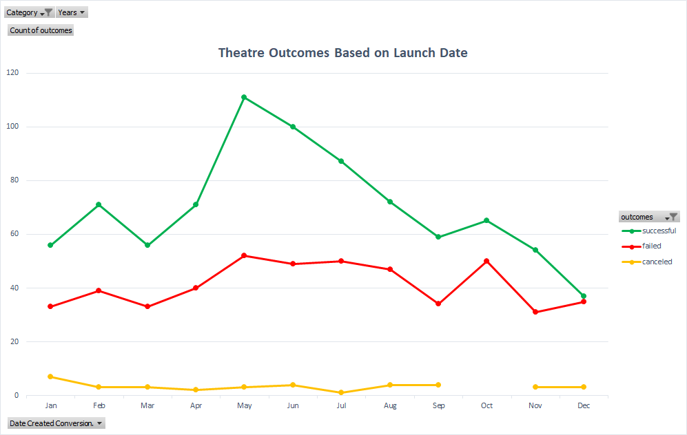

# An Analysis of Kickstarter Crowdfunding Data to determine a Campaign Strategy. 

## Overview 
Louise is an up and coming playwright who wants to start a crowdfunding campaign to fund her play *Fever*. She has estimated a budget over 10,000 dollars. She is interested to know how different campaigns fared in relation to their launch dates and their funding goals. Success of crowdfunding campaigns may depend on many factors, quantitative and qualitative both. In this analysis, we are doing a quantitative analysis of the data obtained from Kickstarter, to help Louise determine her campaign strategy.

### Purpose
The purpose of the project is to analyze crowdfunding data obtained from Kickstarter to give Louise insights on how goal ranges and launch dates correlate to the outcomes of the campaigns. 

## Analysis and Challenges
The Kickstarter data set used in this analysis contains 4114 records on campaigns launched from 2009 to 2017. The data set was loaded and processed in Excel. The first analysis was done to determine correlation, if any, between outcomes and the launch dates of the campaigns. The second analysis was done to determine the correlation between the outcomes and goals of a campaign. 

### Analysis of Outcomes Based on Launch Date

This graph shows the number of outcomes of campaigns by month from years 2009 to 2017. However the data set for the year 2017 is not relevant since only the data for January and February are available, making the data set is incomplete. However, with or without taking 2017 in consideration, the month of May and June have relatively more successful campaigns than failed campaigns. From this graph, it can also be concluded that campaigns starting in the months of October to December have more failed campaigns than the rest of the year. 

### Analysis of Outcomes Based on Goals

This graph shows the percentage of successful campaigns in the range of the goal amounts. It is evident from the graph that certain ranges have higher percentage of successful campaigns. The goal amount upto 5000 dollars is most likely to be successful than higher goal amounts. Additionally, the range of 35,000 dollars to 45,000 dollars also appears to have a higher ratio of sucessful campaigns, however, the total number of campaigns conducted in this range is significantly low which makes the data in this region of the graph insignificant to this study.   

### Challenges and Difficulties Encountered

This data set contained several outliers that were skewing the data. Additionally, only the data from January and February was available for the year 2017, which would also affect the calculations as well as the graphs for the analysis done based on Launch date. 

## Results

We found that the outcomes of the campaign do have a correlation with the launch dates of the respective campaigns as well as with the goal amount of the campaigns.  

- What are two conclusions you can draw about the Outcomes based on Launch Date?

Campaigns that started in May and June were relatively more successful than those launched in other months. Campaigns that started in the October and till end of the year, were the least successful campaigns throughout the year. 

- What can you conclude about the Outcomes based on Goals?

Campaigns with goal amounts under 5000$ were more likely to be successful than campaigns with higher goal amounts. 

- What are some other possible tables and/or graphs that we could create?

###Limitations

This analysis was conducted on data set from a single website, Kickstarter. However, quantitative analysis using data from various different crowdfunding websites may result in more insightful and reliable conclusion. Moreover, using qualitative data in addition with quantitative data might also reveal more well rounded insights into determining factors involved in making campaign successful. 

